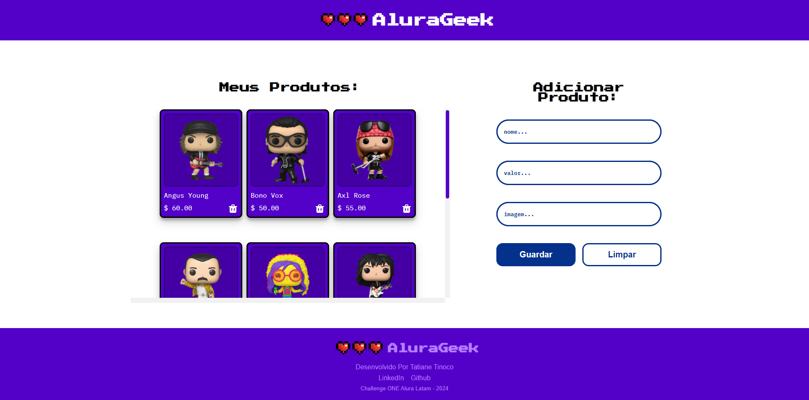

# Challenge ONE AluraGeek

### Desafio ONE Oracle + Alura -  AluraGeek

Desafio do Programa ONE (Oracle Next Education) em parceria com a Alura: Desenvolver uma aplicação web para listar, cadastrar e excluir produtos, utilizando HTML, CSS e JavaScript. Para simular uma API REST, foi utilizado o JSON Server, permitindo a implementação dos métodos de requisição GET, POST e DELETE. O layout de referência foi disponibilizado no Figma.

### Funcionalidades:
- Listar Produtos dinâmicamente.
- Cadastrar Produtos via formulário.
- Visualizar Produtos cadastrados.
- Excluir Produtos.

### Layout do Figma:
- [LINK](https://www.figma.com/file/1zm3NNIw4KcI0RQtR6UmqK/New-AluraGeek---PT?type=design&node-id=0-1&mode=design&t=FMgFotfL0V2NCfh1-0) Modelo base do Figma.

### Tecnologias Utilizadas:
- HTML
- CSS
- JavaScript
- JSON Server

### Requisições:
- GET: Obter a lista de produtos.
- POST: Adicionar um novo produto.
- DELETE: Remover um produto.
